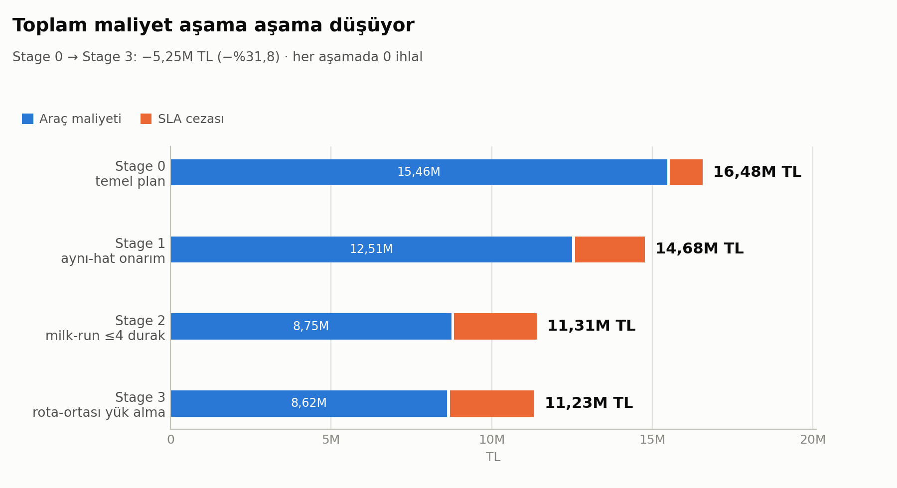
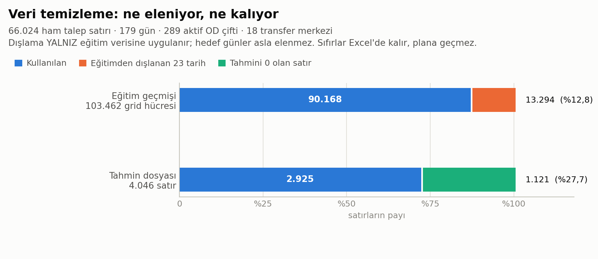
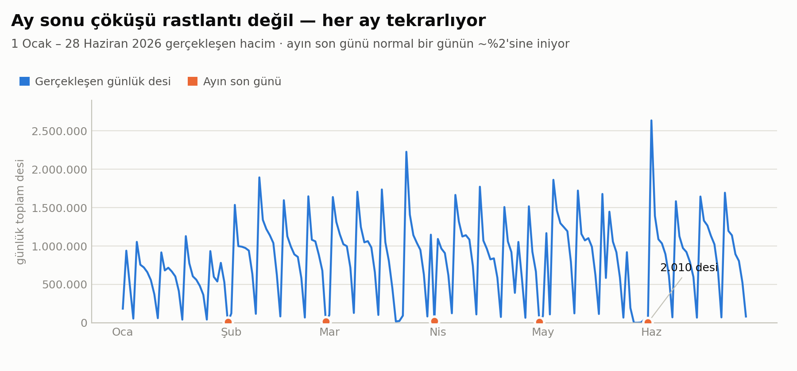
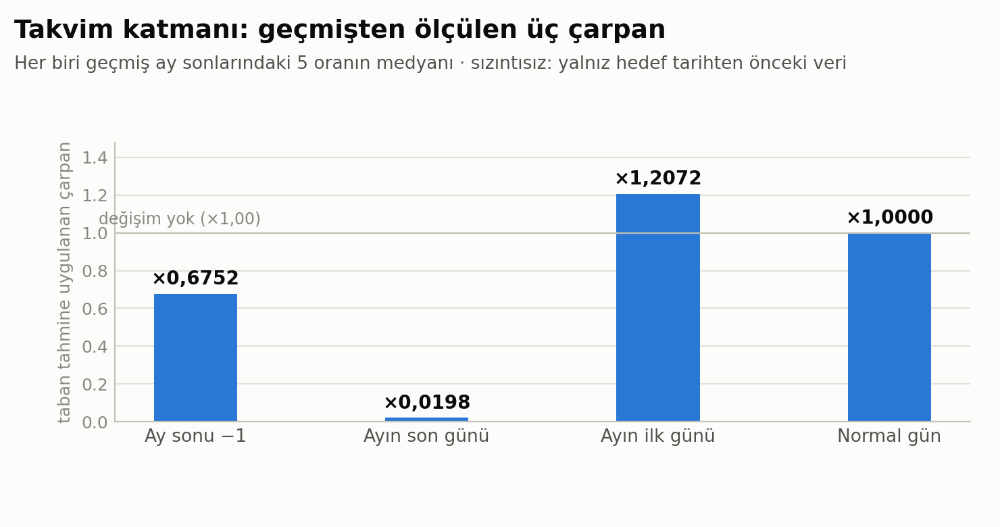
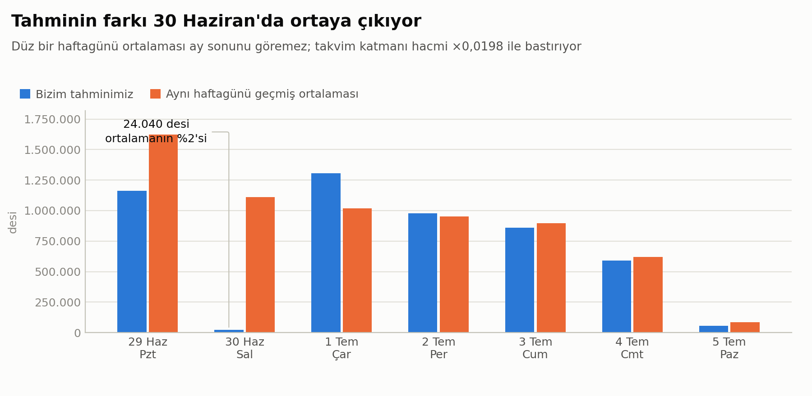
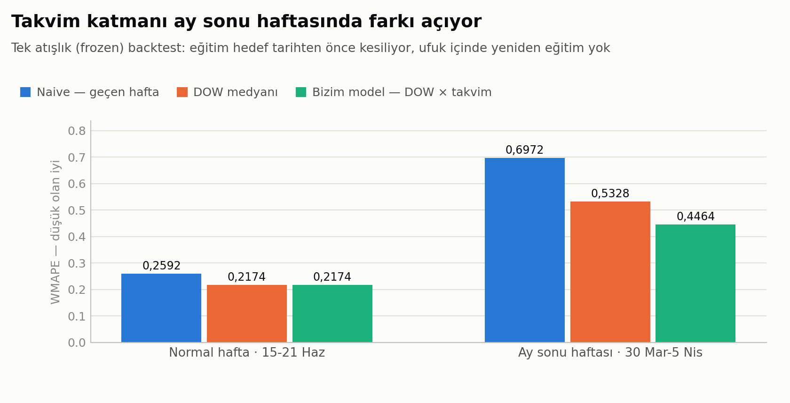
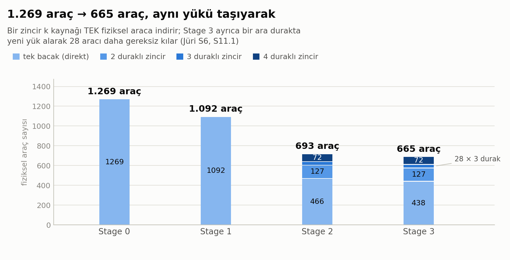
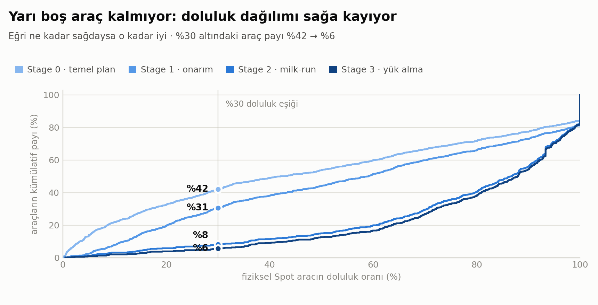
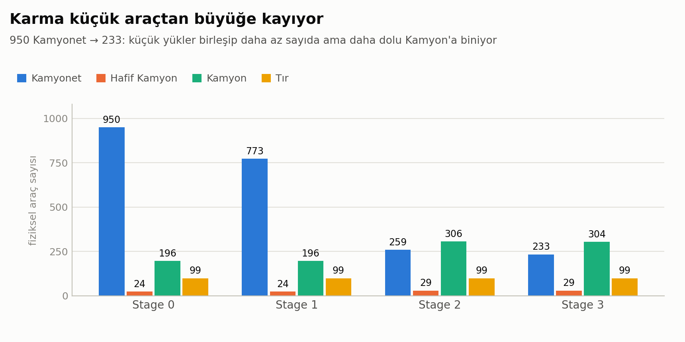

# 🚚 Hepsiburada — Yapay Zeka Destekli Lojistik Anahat Optimizasyonu (Stage 2)

> **Teknofest 2026 · Gelişmiş Çözüm Aşaması** — Hepsiburada iş birliğiyle düzenlenen
> yapay zeka destekli lojistik optimizasyon yarışması, 2. Aşama

İki teslim edilebilir üretiyoruz: **29 Haziran 09:00 – 5 Temmuz 17:00** ufku için bir
**talep tahmini** ve o tahmini en az maliyetle taşıyan bir **taşıma planı**.

| | Sonuç |
|---|---|
| **Toplam maliyet** | **11.232.476,73 TL** (temel plandan **−%31,84**) |
| **Hakem ihlali** | **0** — her aşamada |
| **Test** | **528 / 528 geçiyor** (~4,5 dk) |
| **Uçtan uca çalışma** | `python run.py` → ~105 sn, iki Excel yayınlanır |
| Spot araç doluluğu | %48,02 → **%79,03** |
| Fiziksel araç | 1.269 → **665** |

---

## 📑 İçindekiler

- [Sonuç: maliyet nasıl düştü](#-sonuç-maliyet-nasıl-düştü)
- [Hızlı başlangıç](#-hızlı-başlangıç)
- [1. Talep tahmini](#1-talep-tahmini)
  - [Veri işleme ve temizleme](#11-veri-işleme-ve-temizleme)
  - [Ay sonu olgusu](#12-veride-gördüğümüz-şey-ay-sonu-çöküşü)
  - [Takvim katmanı](#13-takvim-katmanı-üç-ölçülmüş-çarpan)
  - [Tahminimiz vs "sıradan bir gün"](#14-tahminimiz-vs-sıradan-bir-gün)
  - [Backtest](#15-backtest-model-gerçekten-daha-iyi-mi)
- [2. Taşıma planı optimizasyonu](#2-taşıma-planı-optimizasyonu)
  - [Dört aşamalı yapı](#21-dört-aşamalı-yapı)
  - [Araçlar ve milk-run zincirleri](#22-araçlar-ve-milk-run-zincirleri)
  - [Rota ortasında yük alma](#23-rota-ortasında-yük-alma)
  - [Doluluk dağılımı](#24-doluluk-dağılımı)
  - [Araç türü karması](#25-araç-türü-karması)
- [3. Kalite kapıları](#3-kalite-kapıları)
- [4. Jüri Q&A uyumu](#4-jüri-qa-uyumu)
- [5. Mimari](#5-mimari)
- [6. Veri setleri](#6-veri-setleri)
- [7. Sırada ne var](#7-sırada-ne-var)

---

## 🏁 Sonuç: maliyet nasıl düştü

Planı tek hamlede kurmuyoruz. Her aşama bir öncekini **girdi** alır, kendi
iyileştirmesini dener ve **yalnızca hakem simülatörü 0 ihlalle daha düşük maliyet
onaylarsa** kabul edilir. Reddedilen aday resmi çıktıyı değiştirmez.

<picture>
  <source media="(prefers-color-scheme: dark)" srcset="docs/figures/01-maliyet-merdiveni-dark.png">
  
</picture>

| Aşama | Araç maliyeti (TL) | SLA cezası (TL) | **Toplam (TL)** | İhlal |
|---|---:|---:|---:|---:|
| **Stage 0** — temel plan | 15.460.592,57 | 1.020.367,20 | **16.480.959,77** | 0 |
| **Stage 1** — aynı-hat onarım | 12.510.401,25 | 2.169.783,60 | **14.680.184,85** | 0 |
| **Stage 2** — milk-run (≤4 durak) | 8.752.512,29 | 2.560.826,00 | **11.313.338,29** | 0 |
| **Stage 3** — rota-ortası yük alma | 8.616.944,73 | 2.615.532,00 | **11.232.476,73** | 0 |

Dikkat edilecek nokta: **SLA cezası bilerek artıyor.** Araç maliyetinden
6.843.648 TL kazanıp 1.595.165 TL ceza ödüyoruz. Jüri gizli bir SLA tavanı koymadığı
için doğru hedef saf toplam maliyet; bir aracı yola çıkarmaktan kaçınmak, küçük bir
gecikme cezası ödemekten pahalıysa cezayı satın alıyoruz.

---

## ⚡ Hızlı başlangıç

```bash
pip install -r requirements.txt

python -m pytest         # 528 test, ~4,5 dk (gerçek veriyle doğrulama dahil)
python run.py            # ~105 sn → out/Tasima-plani.xlsx + out/Talep-tahmini.xlsx
```

`run.py` her aşamayı sırayla kurar, kapılardan geçirir ve **yalnızca hepsi geçerse**
resmi dosyaları yayınlar. Bir kapı tutmazsa hiçbir dosya değişmez.

Grafikleri yeniden üretmek için:

```bash
python docs/figures/extract_chart_data.py   # ölçümleri chart_data.json'a yazar
python docs/figures/make_figures.py         # 9 figür × açık/koyu tema
```

---

## 1. Talep tahmini

Hedef: her **aktif OD çifti × gün × saat dilimi (09:00 / 17:00)** için desi tahmini.
Çıktı 4.046 satır, toplam **4.977.975 desi**. Başarı ölçütü **WMAPE**.

Model tek satırda:

```
tahmin = DOW_medyan_tabanı(k=4, tatiller/ay sonları hariç) × takvim_çarpanı(gün)
```

### 1.1 Veri işleme ve temizleme

Ham veri 66.024 talep satırı, 1 Ocak – 28 Haziran 2026, 179 gün, 289 aktif OD çifti,
18 transfer merkezi. Uygulanan işlemler:

| Adım | Ne yapılıyor | Nerede |
|---|---|---|
| **Dosya çözümü** | Windows'ta NFD kalmış Türkçe dosya adları NFC'ye normalize edilerek bulunur | `src/data.py:61` |
| **Doğrulama** | 306 hat, 18 merkez, benzersiz anahtarlar, sonlu/pozitif sayılar, tam sayı kapasiteler — hepsi zorunlu | `src/data.py:80-119` |
| **Normalizasyon** | `tarih` → datetime, `'9:00'` → `'09:00'`, `toplam_desi` → int64 | `src/data.py:197` |
| **Tam grid** | OD × gün × 2 slot; veride görünmeyen hücre **desi = 0** demektir | `src/backtest.py:39` |
| **Eğitim filtresi** | 23 tarih dışlanır: 15 resmî tatil + Ocak–Mayıs'ın son iki günü | `src/backtest.py:13-36` |
| **Taban model** | (çıkış, varış, slot, haftagünü) bazında, hedef tarihten **kesin önceki** son 4 gözlemin **medyanı** | `src/backtest.py:74` |
| **Takvim katmanı** | 3 global çarpan, geçmiş ay sonlarından ölçülür | `src/forecast.py:80` |
| **Çıktı** | yuvarlama, kararlı sıralama, `D00001…` kimlikleri, tam grid | `src/forecast.py:185` |

<picture>
  <source media="(prefers-color-scheme: dark)" srcset="docs/figures/06-veri-temizleme-dark.png">
  
</picture>

| Seviye | Toplam | Kullanılan | Elenen |
|---|---:|---:|---:|
| Eğitim geçmişi (grid hücresi) | 103.462 | 90.168 | 13.294 (%12,8) — 23 dışlanan tarih |
| Tahmin dosyası (satır) | 4.046 | 2.925 optimizasyona | 1.121 (%27,7) — desi = 0 |

İki nokta önemli:

- **Dışlama yalnız eğitim verisine uygulanır.** Hedef günler asla elenmez —
  29–30 Haziran zaten tahmin ufkunun içinde. Bu yüzden dışlama listesi bilerek
  yalnız Ocak–Mayıs'ı kapsar.
- **Sıfır satırlar teslim edilen Excel'de kalır** (grid tamlığı için, pozitif taban
  koymuyoruz) ama optimizasyona geçmez — sıfır desi için araç çıkarılmaz.

**Kasıtlı olarak yapmadıklarımız:** outlier temizleme/winsorize, log dönüşümü,
ölçekleme/normalizasyon, smoothing, interpolasyon, trend/mevsim ayrıştırma, harici ML
kütüphanesi (sklearn / statsmodels / Prophet / ARIMA yok). Sebep basit: veri tam,
düzenli ve tek bir güçlü mevsimsellik (haftagünü) ile bir takvim olayı (ay sonu)
tarafından yönetiliyor. Robust medyan bu ikisini yakalıyor; fazlası doğrulanamayan
karmaşıklık olurdu.

### 1.2 Veride gördüğümüz şey: ay sonu çöküşü

<picture>
  <source media="(prefers-color-scheme: dark)" srcset="docs/figures/02-gecmis-gunluk-hacim-dark.png">
  
</picture>

Ayın son günü **her ay** normal bir günün ~%2'sine iniyor — beş ay boyunca istisnasız.
En düşük gözlem 2.010 desi. Bu tek gözlem tahmin puanını domine edebilecek büyüklükte:
30 Haziran'ı normal bir salı sayan bir model o gün tek başına ~1,1 milyon desi hata
üretir.

### 1.3 Takvim katmanı: üç ölçülmüş çarpan

<picture>
  <source media="(prefers-color-scheme: dark)" srcset="docs/figures/04-takvim-carpanlari-dark.png">
  
</picture>

| Takvim rolü | Çarpan |
|---|---:|
| Ay sonundan bir önceki gün | ×0,6752 |
| **Ayın son günü** | **×0,0198** |
| Ayın ilk günü (toparlanma) | ×1,2072 |
| Normal gün | ×1,0000 |

Her çarpan, geçmiş ay sonlarındaki **5 oranın medyanı**: o günün gerçekleşen toplamı /
aynı hücreler için hesaplanan DOW-medyan tabanının toplamı. Tabana bölmek, ay sonu
etkisini haftagünü etkisinden **ayırır**.

Üç ayrı sızıntı (leakage) koruması var:

1. Çarpan uydurulurken yalnız `tarih < hedef` verisi kullanılır.
2. Taban hesabından olay günlerinin kendisi dışlanır.
3. `forecast_horizon`, ufuk içi satır içeren bir `demand` alırsa **hata fırlatır**
   (`src/forecast.py:161`) — yani gerçekleşen değerin modele sızması yapısal olarak
   engellenmiş.

Rol başına en az 2 sonlu örnek yoksa güvenli `1,0` değerine düşer.

### 1.4 Tahminimiz vs "sıradan bir gün"

<picture>
  <source media="(prefers-color-scheme: dark)" srcset="docs/figures/03-tahmin-vs-ortalama-dark.png">
  
</picture>

| Gün | Bizim tahmin | Aynı haftagünü ortalaması | Oran |
|---|---:|---:|---:|
| 29 Haz (Pzt) | 1.161.736 | 1.622.264 | ×0,72 |
| **30 Haz (Sal)** | **24.040** | 1.110.177 | **×0,02** |
| 1 Tem (Çar) | 1.305.721 | 1.016.846 | ×1,28 |
| 2 Tem (Per) | 978.038 | 953.021 | ×1,03 |
| 3 Tem (Cum) | 859.444 | 897.773 | ×0,96 |
| 4 Tem (Cmt) | 591.542 | 619.547 | ×0,96 |
| 5 Tem (Paz) | 57.454 | 86.435 | ×0,67 |

Fark tek bir günde toplanıyor. 29 Haziran ay sonundan bir önceki gün (bastırılmış),
30 Haziran ay sonu (çökmüş), 1 Temmuz toparlanma (yükselmiş). Kalan dört gün düz
ortalamaya çok yakın — yani katman **yalnız gerekli yerde** müdahale ediyor.

### 1.5 Backtest: model gerçekten daha iyi mi?

<picture>
  <source media="(prefers-color-scheme: dark)" srcset="docs/figures/05-backtest-wmape-dark.png">
  
</picture>

| Pencere | Naive (geçen hafta) | DOW medyanı | **Bizim model** |
|---|---:|---:|---:|
| Normal hafta · 15–21 Haz | 0,2592 | 0,2174 | **0,2174** |
| Ay sonu haftası · 30 Mar – 5 Nis | 0,6972 | 0,5328 | **0,4464** |

Bu **tek atışlık (frozen)** backtest: eğitim penceresi hedef tarihten önce kesiliyor ve
ufuk içinde yeniden eğitim yapılmıyor — gerçek yarışma koşulunun aynısı.

Normal haftada iki değer **birebir aynı**, çünkü o pencerede takvim etkisi olan gün
yok; katman devreye girmiyor. Ay sonu haftasında ise WMAPE 0,5328 → **0,4464**
düşüyor. Yani katman zarar vermeden, yalnız gerektiğinde kazandırıyor.

> **Açık kalem:** ay sonu haftasındaki **bias +%28,3**. Tahmin tarafında en yüksek
> değerli iyileştirme alanı bu.

---

## 2. Taşıma planı optimizasyonu

### 2.1 Dört aşamalı yapı

```
Stage 0 · temel plan
  Zorunlu kiralık filo → tır ziyaret bütçesi → spot araç karması + devir
  1.269 araç, 0 ihlal, 16.480.959,77 TL

Stage 1 · aynı-hat onarım
  Aynı hat/gün üzerindeki gereksiz Spot araçları, yükü mevcut araca taşıyarak sil
  1.003 donör değerlendirildi → 177 hamle kabul → 177 Spot araç silindi
  1.092 araç, 0 ihlal, 14.680.184,85 TL

Stage 2 · milk-run (≤4 durak)
  Aynı çıkıştan aynı anda kalkan 2–4 aracı TEK fiziksel araca zincirle
  93 grup · 5.426 çift + 96.369 çoklu kombinasyon denendi → 227 zincir kabul
  693 araç, 0 ihlal, 11.313.338,29 TL

Stage 3 · rota ortasında yük alma
  Zincir bir ara durakta yalnız indirmesin; oradan kalkacak yükü de alsın
  227 hedef rota × 340 donör = 135.660 çift incelendi → 28 yük alma kabul
  665 araç, 0 ihlal, 11.232.476,73 TL
```

Her aşamanın kabul kuralı aynı: **hem taban hem aday 0 ihlal olacak** ve ham tasarruf
pozitif olacak. Aksi hâlde aday atılır, resmi çıktı değişmez. Yayınlayan aşama
(Stage 3) ayrıca **≥ 50.000 TL** tasarruf kapısına takılıdır: aramanın sessizce
çökmesi 1 TL'lik bir tabandan geçebilirdi.

### 2.2 Araçlar ve milk-run zincirleri

<picture>
  <source media="(prefers-color-scheme: dark)" srcset="docs/figures/08-arac-sayisi-zincir-dark.png">
  
</picture>

| Aşama | Fiziksel araç | tek bacak | 2 durak | 3 durak | 4 durak |
|---|---:|---:|---:|---:|---:|
| Stage 0 | 1.269 | 1.269 | — | — | — |
| Stage 1 | 1.092 | 1.092 | — | — | — |
| Stage 2 | 693 | 466 | 127 | 28 | 72 |
| **Stage 3** | **665** | 438 | 127 | 28 | 72 |

Kritik ayrım: **Stage 2'de segment sayısı 1.092'de sabit kalıyor.** Zincir yeni bacak
yaratmıyor; *k* ayrı aracın işini **tek** fiziksel araca bindiriyor. Kimlik kontrolü:
`1.092 − (626 − 227) = 693`. Stage 3 ise zincirlerin **şeklini hiç değiştirmeden**
28 tek-bacaklı aracın yükünü mevcut zincirlere bindirip o araçları siliyor:
`693 − 28 = 665`, segment `1.092 − 28 = 1.064`.

Bunun kural dayanağı jüri Q&A'sında açık:

> **Soru 11.1:** *"Bir aracın tek seferde **birden fazla** transfer merkezine uğrayıp
> sırayla yük bırakması mümkün mü?"*
> **Cevap: "Spot araçlar için evet mümkündür fakat kiralık araçlar için uğrama mümkün
> değildir."**
>
> **Soru 3:** *"…toplam sefer sayısı için herhangi bir **üst sınır** bulunmakta
> mıdır?"* → **"Evet kısıtlamalar dikkate alınarak sınırsız sefer yapabilirsiniz."**

Yani durak sayısına **kural sınırı yok**. `MAX_CHAIN_STOPS = 4` bizim mühendislik
tercihimiz; gerçek sınır **kapasite**: zincirler Tır'sız Spot tipleri kullandığı için
bir rota en çok 12.000 desi taşıyabilir, uygun bir kaynak bacak ise ortalama
4.128 desi. Bu yüzden 4'lü kombinasyonların yalnızca %32'si sığıyor.

Zincirlerin her biri şu değişmezleri korur — hepsi yayınlanan Excel üzerinden
doğrulandı, 665 araçta **0 topoloji hatası**:

- tek `Araç ID`, tek araç türü, hepsi `Spot`, hiç `Tır` yok
- ardışık bacaklar bağlı (`bacak₁.varış == bacak₂.çıkış`), varış tekrarı yok, çıkışa dönüş yok
- araçta kalan yük **ara durakta elleçlenmez** (jüri: yük yalnız indiği/bindiği yerde elleçlenir)
- `Talep ID` bacaklar arası aynı kalır, desi değişmez, ek `-1/-2` eki üretilmez
- fiziksel rotanın araç maliyeti **tam bir kez** beyan edilir
- SLA yalnız her yükün **kendi** iniş anından hesaplanır

### 2.3 Rota ortasında yük alma

Stage 2'ye kadar zincirlerimiz yalnız **indiriyordu**: araç çıkışta her şeyi yükler,
her durakta bir kısmını bırakır, ara durakta yeni yük almaz. Jüri bunun tersini de
açıkça serbest bırakıyor:

> **Soru 6:** *"…Aynı şekilde bir araçtan **x kadar yük indirilip y kadar yük
> yüklenirse** kapasiteden x+y kadar yük düşülür."*

Bu cümle bir aracın aynı merkezde indirip yüklemesini tarif ediyor ve elleçleme
aritmetiğini de veriyor. Yasak yalnız kiralıkta: *"Kiralık araçlarla uğrama yapılmaz."*

Stage 3 bunu **Tier A** biçiminde uyguluyor: alınan yükün varışı, rotanın **zaten
uğradığı** bir durak olmak zorunda. Böylece rota topolojisi hiç değişmez — zincir
uzamaz, `MAX_CHAIN_STOPS` ve K1 sözleşmesi aynı kalır. Kazanç, o yükü ayrı taşıyan
aracın **tamamen ortadan kalkmasından** geliyor.

| | Ölçüm |
|---|---:|
| Hedef rota (çok duraklı, Spot) | 227 |
| Kiralık olduğu için atlanan rota | 126 |
| Donör havuzu (tek bacaklı, dolu, Spot) | 340 |
| İncelenen (rota-durak, donör) çifti | 135.660 |
| Kârlı aday | 56 |
| Çakışmasız kabul | **28** |
| Silinen araç · taşınan parça/desi | 28 · 82 / 65.754 |
| **Tasarruf** | **80.861,55 TL** |

Bir yük alma durağında **iki ayrı zaman damgası** vardır ve bunları karıştırmak sessiz
bir hata olur:

```python
unload_end   = arr + handling(inen desi)        # SLA BU ana göre hesaplanır
depart_after = unload_end + handling(alınan)    # sonraki segment BUNDAN kalkar
```

İnen kargo, indirmesi bittiği anda teslim edilmiştir; sonrasında başlayan **yükleme
işlemi aracı geciktirir ama teslimatı geciktirmez**. Aynı şekilde alınan yük yalnız
`yükleme durağı → kendi varış durağı` aralığındaki segmentlerde taşınır; hedefini
geçip devam etmesi hem SLA'yı hem kapasiteyi bozardı. Her ikisi de `tests/test_pickup.py`
içinde birer regresyon testiyle çivili.

Bir yan kazanç: boşalt+yükle durağı `TirLedger`'da **1** ziyaret tüketir, 2 değil —
hakem, bacak *i*'nin varışıyla bacak *i+1*'in kalkışını aynı `visit_id` altına yazar.

### 2.4 Doluluk dağılımı

<picture>
  <source media="(prefers-color-scheme: dark)" srcset="docs/figures/07-doluluk-dagilimi-dark.png">
  
</picture>

| Aşama | Ortalama doluluk | %30 altındaki Spot araç |
|---|---:|---:|
| Stage 0 | %48,02 | 480 / 1.143 (%42) |
| Stage 1 | %56,82 | 296 / 966 (%31) |
| Stage 2 | %76,96 | 46 / 567 (%8) |
| **Stage 3** | **%79,03** | **30 / 539 (%6)** |

Eğri ne kadar sağdaysa o kadar iyi. Yarı boş araç neredeyse kalmadı.

Stage 2 sonrası kalan 46 aracı **aynı hatta** birleştirmeyi denedik: hiçbiri
birleştirilemiyor — 46'sının 46'sı da o gün o hattın tek aracı, yani birleşecek eş
yok. Aynı-hat sezgisiyle kazanılabilecek tutar tam olarak **0 TL**. Stage 3 bu duvarı
farklı bir yönden aşıyor: aynı hatta eş aramak yerine yükü **oradan geçen** bir
zincire bindiriyor — %30 altındaki araç sayısı 46'dan 30'a iniyor.

### 2.5 Araç türü karması

<picture>
  <source media="(prefers-color-scheme: dark)" srcset="docs/figures/09-arac-turu-karmasi-dark.png">
  
</picture>

| Araç türü | Stage 0 | Stage 1 | Stage 2 | Stage 3 |
|---|---:|---:|---:|---:|
| Kamyonet (5.600 desi) | 950 | 773 | 259 | **233** |
| Hafif Kamyon (7.200) | 24 | 24 | 29 | 29 |
| Kamyon (12.000) | 196 | 196 | 306 | **304** |
| Tır (22.400) | 99 | 99 | 99 | 99 |

Karma küçükten büyüğe kayıyor: yarı boş Kamyonet'ler birleşip daha az sayıda ama daha
dolu Kamyon'a biniyor. Tır sayısı sabit — tır kapasitesi kıt bir kaynak (7 merkezde
**sıfır**) ve onu zorlamıyoruz.

---

## 3. Kalite kapıları

Bu projede tek bir sayıya bile "hesapladım, doğrudur" demiyoruz. Her şey bağımsız
olarak yeniden hesaplanıyor.

**Hakem simülatörü (`src/simulator.py`).** Planlayıcıdan tamamen ayrı yazılmış ikinci
bir uygulama. Yalnızca çıktı DataFrame'lerini okur; maliyeti, SLA'yı ve 17 kuralı
sıfırdan yeniden hesaplar. Optimizer daha yazılmamışken bile iki optimizer-sınıfı
hatayı yakaladı. Bir aday plan hakemden 0 ihlalle geçmezse **kabul edilmez**.

**Aşama kapıları (`run.py`).** Stage 0, Stage 1, Stage 2 ve Stage 3, kabul edilmiş
sonuçlarına **birebir sabitlerle** çivili. Örneğin Stage 2 için 20, Stage 3 için 23
sabit: maliyetler, sayımlar, her `MilkRunMetrics` / `PickupMetrics` alanı ve
zincirlerin **şekli** (`2 ≤ uzunluk ≤ MAX_CHAIN_STOPS`, yalnız Spot, asla Tır, rota
başına tek araç türü). Stage 3 ayrıca **yük almanın şeklini** de doğruluyor: rota
ortasında yük yalnız Spot rotada alınabilir ve bir yükün indiği durak **kendi nihai
varışı** olmak zorunda. Arama algoritmasında sessizce kazanç kaybettiren bir değişiklik
olursa boru hattı **yayını reddeder** ve farkı satır satır basar. Bu kapı `k=4`
geçişinde gerçekten devreye girdi.

**Uzlaşma kapısı.** Aramanın kendi aritmetiğiyle topladığı tasarruf ile hakemin
ölçtüğü fark, kuruşun milyonda birine kadar **aynı sayı** olmak zorunda. Rota-ortası
yük alma prototipinde bulunan üç hatanın (kiralık rotayı hedef almak, yanlış SLA zaman
damgası, yükün hedefini geçmesi) **üçünü de** bu kapı yakaladı; başka hiçbir kontrol
fark etmiyordu.

**Determinizm.** `milk_run_improve` ve `pickup_improve` aynı girdiyle ve
**karıştırılmış** girdiyle çalıştırıldı: hepsinde plan birebir aynı. Teslim edilen
dosya girdi sırasına bağlı değil.

**Artifact doğrulama.** Yayından önce Excel dosyaları tekrar okunur, şema doğrulanır,
parmak izleri (fingerprint) karşılaştırılır ve hakem **yeniden** çalıştırılır. Yayın
plan-önce sırasıyla ve geri alınabilir (rollback-safe) yapılır.

**Format = diskalifiye** olduğu için `src/schemas.py` kolon adlarını birebir
doğrular (`Araç Tipi` vs `Araç türü` tuzağı dahil), hücre tiplerini ve sayı
biçimlerini şablonla eşler.

---

## 4. Jüri Q&A uyumu

Tüm jüri Q&A dokümanı satır satır kodla eşleştirildi. Öne çıkanlar:

| Kural | Nasıl uygulandı |
|---|---|
| Süreler **yukarı** yuvarlanır (0,92 sa = 55,2 dk → **56**) | `src/timeutil.py` — float artefakt koruması dahil |
| Gece yarısı elleçleme **oransal** bölünür (23:30'da 10.000 desi → 3.000 / 7.000) | `HandlingLedger` |
| Elleçleme araç-durak başına **tek toplu** işlem, `⌈Σdesi × 0,01⌉` | planlayıcı ve hakem aynı modeli kullanır |
| Satır başına beyan **desi payına göre** dağıtılır | `src/schedule.py` |
| Kiralık araçlar **uğrama yapamaz**, dönüş yapmaz | zincirler yalnız Spot; rota-ortası yük alma hedefi de yalnız Spot; hakem kural 12 |
| Bir merkezde x indirilip y yüklenirse kapasiteden **x+y** düşülür (S6) | `src/pickup.py` — indirme ve yükleme iki ardışık işlem; SLA indirmenin bitişinden, kalkış yüklemenin bitişinden |
| Kiralık filo **dağıtım bitene kadar** her gün çıkar (boş olsa bile) | 6–7 Tem dahil 126 bacak; hakem `rental_days` otomatik uzatır |
| Boş spot araç döndürülmez | optimizer dönüş bacağı üretmez |
| Aktarımda `Talep ID` değişmez, desi iki kez sayılmaz | `base_demand_id` + desi korunum kontrolleri |
| `Yolculuk süresi` bölünmez, her satıra tam yazılır | `src/schedule.py` |
| Tır kapasitesi = günlük toplam ziyaret; sabit yeniden yükleme 1, çıkıp dönme 2 | `TirLedger` `(araç, ziyaret)` küme semantiği |
| Bir `Araç ID` = bir fiziksel araç, tutarlı tür | 0 karışık-tür kimlik; hakem kural 5 |
| Gizli SLA tavanı yok — saf toplam maliyet | bilinçli ceza satın alma |

**Açık yorum riski olarak izlediğimiz konular:** kiralık `Araç ID`'lerinin günler arası
kalıcılığı (biz gün-bazlı benzersiz kullanıyoruz — muhafazakâr), jürinin beyan edilen
maliyet kolonlarını mı yoksa yeniden hesabı mı puanladığı (ikisi de tutarlı olacak
şekilde yazıyoruz) ve `desi = 0` satırlarının kabul edilip edilmediği.

---

## 5. Mimari

```
datas/*.xlsx
   ▼
src/data.py        Doğrulamalı Excel yükleyiciler → CompetitionData
   ▼
src/forecast.py    DOW-medyan tabanı × sızıntısız takvim çarpanları
   ▼
src/optimize.py    Günlük orkestrasyon: kiralık doldurma → tır bütçesi →
   │               spot karma sayımı (devirli) → sarkma günleri
   ▼
src/schedule.py    Dakika çizelgesi: V/D-ID ataması, gece yarısı taşma
   │               onarımı, Q&A-birebir beyan kolonları
   ▼
src/simulator.py   HAKEM — maliyet + 17 kuralı bağımsız yeniden hesaplar
   ▼
src/evaluation.py  Kopya-sahipli çizelge/hakem, kesin metrikler, parmak izleri
   ▼
src/repair.py      Aynı-hat onarım (Stage 1)
   ▼
src/chain.py       Nötr fiziksel rota doğrulama + bacak başına yük akışı
   ▼
src/milkrun.py     Deterministik k-duraklı milk-run (Stage 2)
   ▼
src/pickup.py      Deterministik rota-ortası yük alma, Tier A (Stage 3)
   ▼
src/export.py      Şablon-birebir yazıcılar, round-trip doğrulama,
                   geri alınabilir plan-önce yayın

run.py             Aşamalı / hakemli / yayınlı uçtan uca akış
tests/             528 test
docs/figures/      README grafikleri + yeniden üretim betikleri
```

Bağımlılık yönü tek taraflı: `optimize.py` zincir katmanını **bilmez**, `simulator.py`
bu grafın tamamen dışındadır. Aşama orkestrasyonunu yalnızca `run.py` sahiplenir.

---

## 6. Veri setleri

| Dosya | Açıklama |
|---|---|
| `datas/teknofest26_gelismis.xlsx` | Ana talep veri seti (Talep ID, desi, tamamlanma saati) |
| `datas/Araç_Kapasite_Maliyet_Saat.xlsx` | Kiralık/spot araç kapasite ve maliyetleri |
| `datas/Kiralık_Araclar.xlsx` | Kullanılması zorunlu kiralık araç listesi |
| `datas/sehirler_arasi_lojistik.xlsx` | Merkezler arası mesafe, seyir süresi, SLA (306 hat = 18×17, **tam matris**) |
| `datas/Ellecleme-kapasite.xlsx` | Merkez başına günlük elleçleme kapasitesi |
| `datas/tir_kapasiteleri v2.xlsx` | Günlük tır kapasiteleri — **v2, jürinin güncellediği sürüm; v1 kullanmayın** |
| `datas/TALEP TAHMİNİ.xlsx` | Talep tahmini çıktı **şablonu** |
| `datas/TAŞIMA PLANI.xlsx` | Taşıma planı çıktı **şablonu** |

### Toplam maliyet formülü

```
Toplam Maliyet = Araç Maliyeti + SLA Cezası
Araç Maliyeti  = (Saatlik Kira × Kullanım Süresi) + (Mesafe × Km Başı Maliyet)
SLA Cezası     = Geciken Desi × ⌈Gecikme Saati⌉ × 0,40 TL
```

Kullanım süresi **bekleme ve elleçleme dâhil** tek sürekli pencere olarak sayılır
(jüri Soru 9 ve 12).

---

## 7. Sırada ne var

Taşıma planı tarafı yayınlanabilir durumda. Kalanlar iyileştirme, eksik değil.

| Öncelik | Konu | Durum |
|---|---|---|
| **1** | **Ay sonu haftasında tahmin bias'ı (+%28,3)** | En yüksek değerli açık kalem; tahmin ayrı puanlanıyor. Seçenekler: slot-bazlı çarpanlar, toparlanma kalibrasyonu |
| 2 | **Rota ortasında yük alma — Tier B** | Tier A yayında (−80.861 TL). Tier B rotayı **bir durak uzatır**: bağımsız bir ölçüm A+B için ~146k TL gördü, yani ek ~66k TL. Ama 5 duraklı rota üretir; `MAX_CHAIN_STOPS` ve K1 dokümantasyonu değişir, ayrı karar konusu |
| 3 | **5 duraklı zincir** | Kaba kuvvetle **uygulanamaz**: 13,5 dk CPU + 1,3 GB'dan sonra sonuç yok (C(n,5)=254.992 alt küme × 120 sıra). Budama (branch-and-bound) gerekir |
| 4 | **Tır'ı zincire katmak** | Kural engeli **yok** (yasak yalnız kiralıkta). Kapasite tavanını 22.400'e çıkarır. Ama tır kapasitesi 7 merkezde sıfır — ölçüldü, **+18.100 TL daha kötü** (aşağıya bakın) |
| 5 | Hub konsolidasyonu, parametre taraması | Sıradaki normal iyileştirmeler |

### Ölçülmüş çıkmaz sokaklar (tekrar denenmemeli)

| Fikir | Ölçüm |
|---|---|
| Düşük dolulukta aynı-hat birleştirme | **0 TL** — 46 aracın 46'sı o gün o hattın tek aracı |
| Tır'ı zincire katmak | Tam yama **+18.100 TL DAHA KÖTÜ**; minimal yama bit-bazında aynı. Kamyon aynı 12.000 kapasitede Tır'ı her koşulda eziyor (318,25 vs 487,50 TL/sa); kârlı Tır adaylarının %93,6'sı kapasitesi-0 yedi merkez yüzünden ölüyor |
| Tahmin bias'ını düzeltme (slot-bazlı, +2. gün, toparlanma, taban kalibrasyonu) | Hedef sahte: +%28,3 bias, 29 Mart cutoff'unda `first_day` çarpanının n=2 ile uydurulmasının artefaktı. LOO ile teslim modelinin bias'ı **−0,0573**. Dört adayın dördü de dışsal örneklemde başarısız |
| Greedy yerine tam eşleme (max-weight matching) | 47.796 TL, ama çoklu-durak geçişinin **alternatifi**, toplamı değil; mevcut çözüm bunu ~476k TL ile aşıyor |
| En kötü talepleri hedefleyerek SLA azaltma | Uzun kuyruk — en kötü 20 talep cezanın yalnız ~%15'i |

---

## 🏆 Yarışma bilgileri

| Alan | Bilgi |
|---|---|
| Yarışma | Teknofest 2026 |
| Sponsor | Hepsiburada |
| Kategori | Yapay Zeka Destekli Lojistik Optimizasyon |
| Aşama | Stage 2 — Gelişmiş Çözüm Aşaması |
| Ufuk | 29 Haziran 09:00 – 5 Temmuz 17:00 |

Detaylı teknik referans: [`ARCHITECTURE.md`](ARCHITECTURE.md) ·
proje durumu ve doğrulanmış sonuçlar: [`PLAN.md`](PLAN.md) ·
kabul raporu:
[`docs/superpowers/reports/`](docs/superpowers/reports/)
